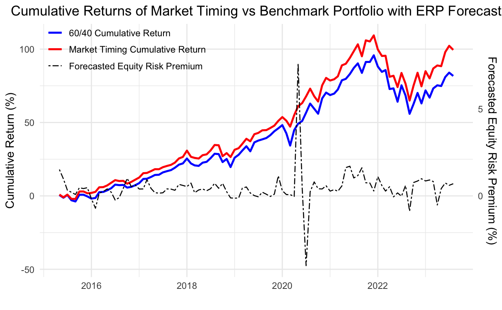
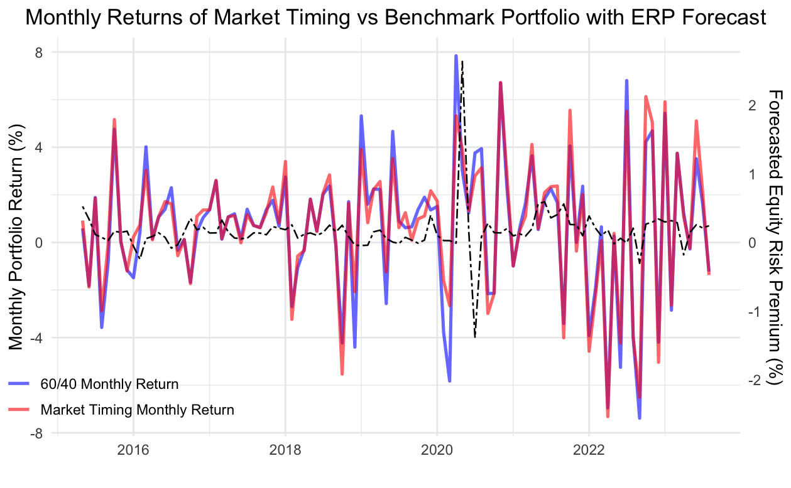
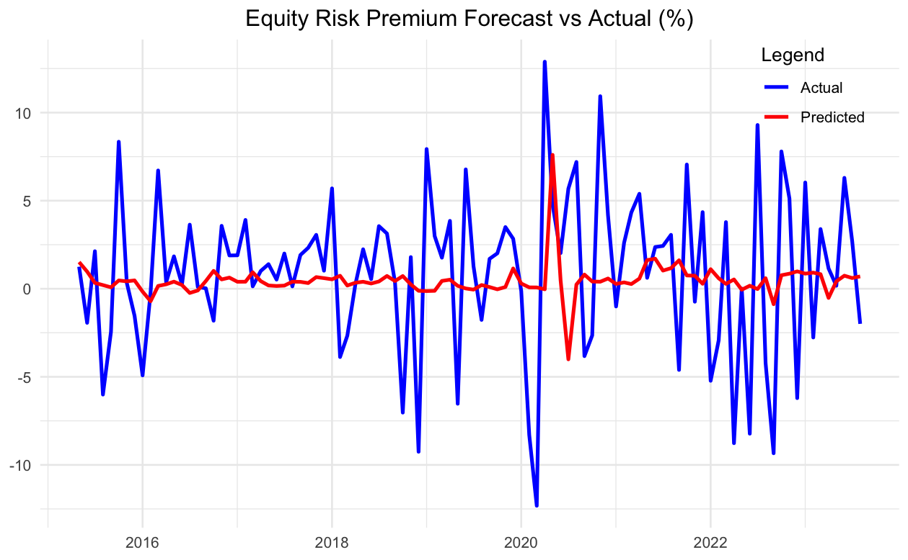
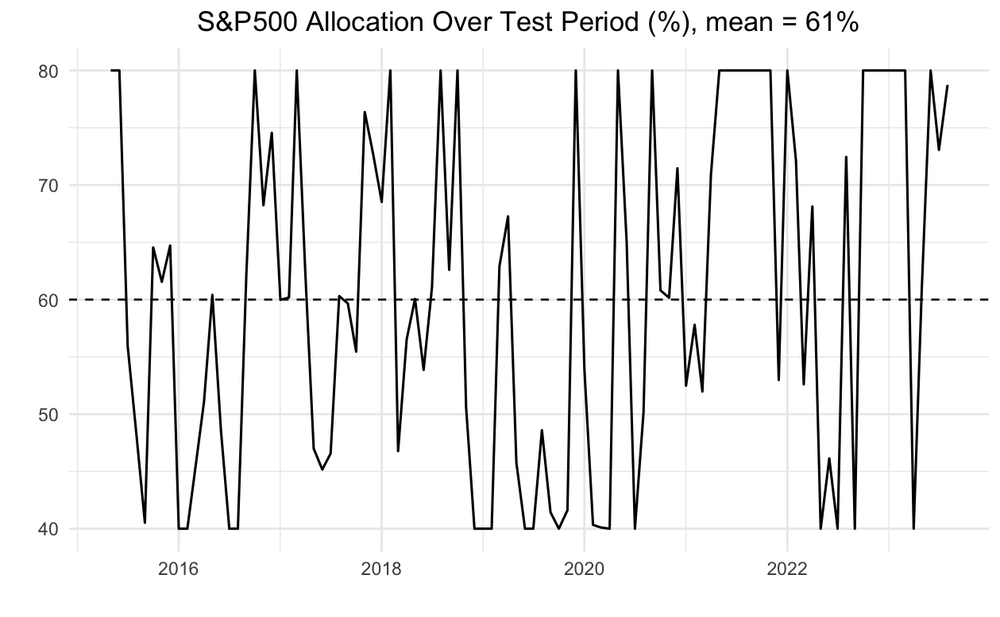
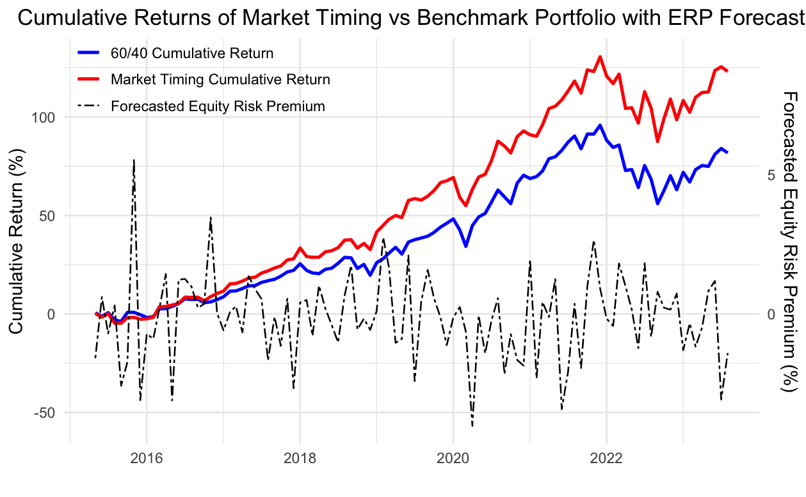
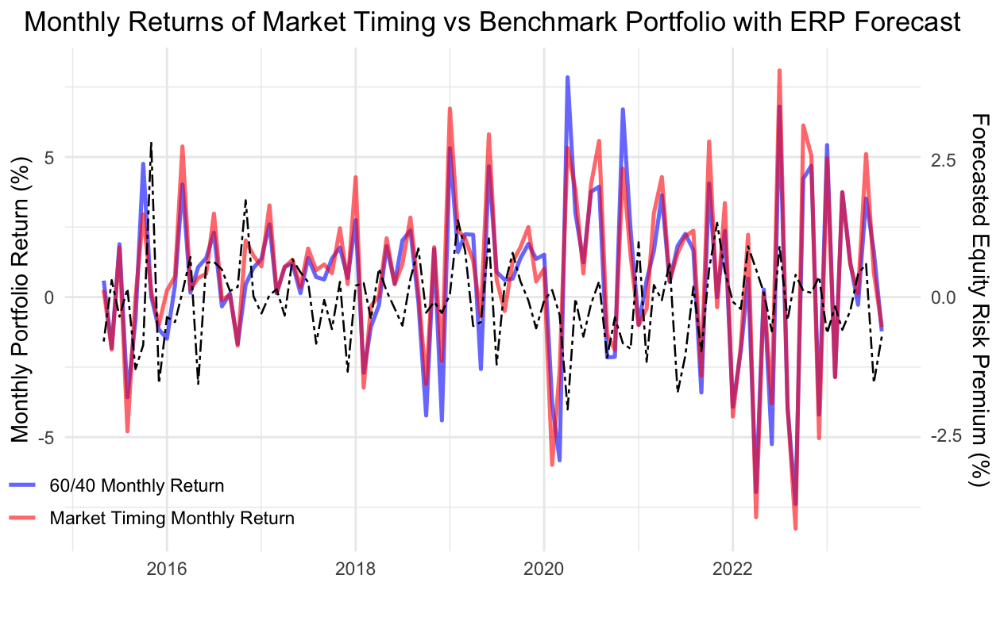
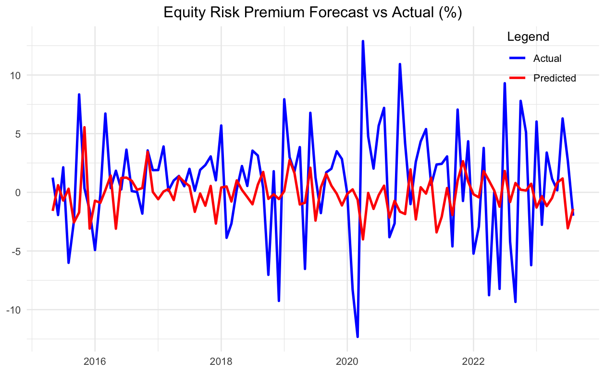
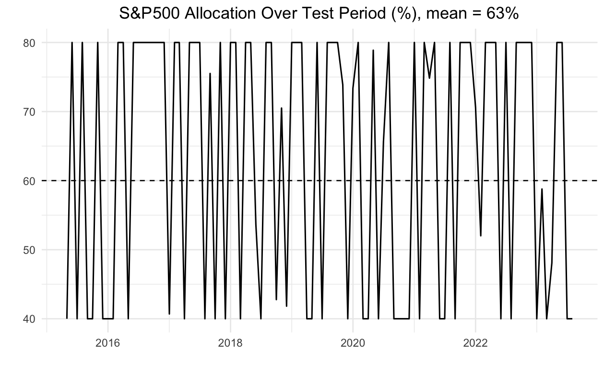

# Forecasting-Equity-Risk-Premium

## Introduction

Equity risk premium (ERP) forecasting asks whether excess equity returns are predictable using information such as valuation ratios, interest rates, yield spreads, and activity/slack indicators. Many variables look predictive in-sample, but out-of-sample—especially monthly—most lose power; signal-to-noise is low and out-of-sample R² values are often near zero or negative (Goyal et al., 2024).

At the same time, the number of proposed predictors has grown large (macro, valuation, term-structure, credit, volatility/liquidity, and technical indicators). This yields a high-dimensional setting where P can approach or exceed N; unrestricted OLS becomes unstable due to multicollinearity and overfitting. Prior work uses shrinkage (ridge, lasso) and factor-based methods (principal components, partial least squares).

We study whether machine-learning methods can extract a stable predictive signal for the monthly ERP in this high-dimensional setting.

### Equity Risk Premium Definition

We target the realized (ex-post) ERP: the S&P 500 total return (including dividends) in month t minus the concurrent risk-free rate from 1-month U.S. Treasury bills. We focus on the ex-post premium because it is directly measurable at the monthly horizon and matches the investor’s decision between equities and a risk-free asset in our market-timing exercise (cf. Fernández, 2006).

### Data Overview

- 35 monthly financial and macroeconomic predictors from the Goyal–Welch dataset (valuation ratios, rates/term-structure, credit spreads, real activity, volatility/liquidity).  
- Technical indicators following Neely–Rapach–Tu–Zhou (2014): moving-average crossovers, momentum, and volume-based measures such as on-balance volume (OBV). S&P 500 volume is sourced via yfinance.  
- Sample: May 1996 – Aug 2023 (328 months). Predictors are aligned so only information available at t is used to forecast ERP at horizons h ∈ {1, 3, 6, 12}.  
- Publication lags (1 month) applied to: `infl` (CPI inflation), `ndrbl` (durables new orders–to–shipments), and earnings-based variables (`e12`, `e/p`, `d/e`). All others use contemporaneous month-t values when available.

## Market-Timing Strategy

Benchmark portfolio: static 60/40 with S&P 500 total return (equities) and IEF (intermediate U.S. Treasuries). The 60/40 mix is a widely used reference, offering diversification and drawdown mitigation and approximating a moderate-risk efficient allocation.

Summary stats (annualized, evaluation period):

| Asset   | Return (%) | Volatility (%) |
|---------|-----------:|---------------:|
| S&P 500 |       11.9 |           15.8 |
| IEF     |        0.2 |            6.4 |

Design principles:

1) **Symmetric risk taking:** increase (decrease) equity weight when the forecasted ERP is above (below) the model’s own historical norm.  
2) **Risk control:** weights remain close to 60/40; we cap equity within a band of ±20 percentage points.  
3) **Scale discipline:** aggressiveness depends only on the model’s own forecast variability.

Signal construction and mapping (notation only; implemented in code):

- Compute in-sample mean and standard deviation of 100 historical forecasts in the training window (2006-12 to 2015-03).  
- Standardized signal: `signal_t = (ERP_hat_t − ERP_bar_IS) / sigma_IS`.  
- Equity weight: `w_eq_t = 0.60 + signal_t`, capped to `[0.40, 0.80]`.  
- Bond weight: `1 − w_eq_t`.

### Economic Performance of Market Timing Strategies

We report monthly-frequency statistics over the test period:  
(i) annualized Sharpe (mean monthly excess over T-bill divided by monthly volatility, ×√12),  
(ii) annualized return (CAGR),  
(iii) maximum drawdown, and  
(iv) hit rate vs 60/40 (fraction of months the strategy outperforms).  
The 60/40 benchmark is included for reference.

## Portfolio Metrics and Performance Analytics

**Table: Market timing strategies vs. 60/40 benchmark for different horizons. Strategies sorted by ann. Sharpe.**

| Strategy | Ann. Sharpe | Ann. Return (%) | Max Drawdown (%) | Hit Rate (%) |
|---|---:|---:|---:|---:|
| **Forecast horizon, _h_ ∈ {1, 3, 6, 12}** ||||| 
| 60/40 Benchmark | 0.77 | 7.4 | 20.3 | — |
| **h = 1** ||||| 
| Lasso v2 (highest Sharpe) | 0.91 | 8.6 | 21.2 | 51 |
| Ridgeless | 0.87 | 8.1 | 20.3 | 56 |
| Ensemble | 0.85 | 7.7 | 21.1 | 53 |
| Elastic Net | 0.76 | 7.7 | 22.0 | 45 |
| Lasso v1 | 0.75 | 7.0 | 19.4 | 48 |
| Ridge | 0.74 | 6.7 | 19.4 | 46 |
| PLS | 0.73 | 7.4 | 19.4 | 54 |
| Random Forest | 0.64 | 6.0 | 23.0 | 47 |
| XGBoost | 0.53 | 5.3 | 23.6 | 42 |
| **h = 3** ||||| 
| Lasso v2 (highest Sharpe) | 0.94 | 8.8 | 17.1 | 54 |
| XGBoost | 0.89 | 8.5 | 17.4 | 53 |
| Ensemble | 0.82 | 7.4 | 18.8 | 50 |
| Lasso v1 | 0.81 | 7.8 | 23.1 | 51 |
| Random Forest | 0.78 | 7.0 | 21.0 | 53 |
| Ridgeless | 0.76 | 7.6 | 21.8 | 53 |
| Ridge | 0.69 | 6.8 | 19.2 | 51 |
| Elastic Net | 0.69 | 6.8 | 19.2 | 51 |
| PLS | 0.61 | 4.8 | 18.7 | 36 |
| **h = 6** ||||| 
| Ridgeless (highest Sharpe) | 0.98 | 10.1 | 18.7 | 59 |
| XGBoost | 0.94 | 8.6 | 19.4 | 57 |
| Ensemble | 0.83 | 7.3 | 19.0 | 54 |
| Lasso v2 | 0.78 | 6.6 | 20.0 | 45 |
| Random Forest | 0.75 | 7.0 | 20.0 | 59 |
| Lasso v1 | 0.73 | 6.2 | 21.3 | 42 |
| Ridge | 0.79 | 9.7 | 22.0 | 65 |
| Elastic Net | 0.78 | 9.7 | 22.0 | 65 |
| PLS | 0.61 | 4.7 | 18.7 | 33 |
| **h = 12** ||||| 
| XGBoost (highest Sharpe) | 1.03 | 9.8 | 15.8 | 58 |
| Ensemble | 0.96 | 8.6 | 18.9 | 53 |
| Elastic Net | 0.92 | 9.2 | 18.1 | 54 |
| Random Forest | 0.92 | 9.0 | 22.0 | 52 |
| Ridgeless | 0.80 | 8.0 | 22.1 | 47 |
| PLS | 0.88 | 6.9 | 18.7 | 44 |
| Lasso v2 | 0.86 | 8.5 | 18.0 | 53 |
| Ridge | 0.78 | 9.5 | 22.0 | 64 |
| Lasso v1 | 0.77 | 8.8 | 18.3 | 60 |

<!-- ==== Lasso_v2 (h = 1) ==== -->

<h3 id="lasso-h1">Lasso_v2 (h = 1)</h3>

<table>
  <tr>
    <td width="50%">
      
      
<em>Lasso_v2 (h=1): Cumulative Return</em>

    </td>
    <td width="50%">
      
      
<em>Lasso_v2 (h=1): Monthly Return</em>

    </td>
  </tr>
  <tr>
    <td width="50%">
      
      
<em>Lasso_v2 (h=1): ERP Forecast vs Actual</em>

    </td>
    <td width="50%">
      
      
<em>Lasso_v2 (h=1): Equity Weight</em>

    </td>
  </tr>
</table>

 

<!-- ==== Ridgeless (h = 6) ==== -->

<h3 id="ridgeless-h6">Ridgeless (h = 6)</h3>

<table>
  <tr>
    <td width="50%">
      
      
<em>Ridgeless (h=6): Cumulative Return</em>

    </td>
    <td width="50%">
      
      
<em>Ridgeless (h=6): Monthly Return</em>

    </td>
  </tr>
  <tr>
    <td width="50%">
      
      
<em>Ridgeless (h=6): ERP Forecast vs Actual</em>

    </td>
    <td width="50%">
      
      
<em>Ridgeless (h=6): Equity Weight</em>

    </td>
  </tr>
</table>

## References

- Diebold, F. X., & Mariano, R. S. (1995). Comparing predictive accuracy. *Journal of Business & Economic Statistics, 13*(3), 253–263.  
- Fernández, P. (2006). Equity premium: Historical, expected, required and implied. Technical Report WP-661, IESE Business School.  
- Goyal, A., Welch, I., & Zafirov, A. (2024a). A comprehensive 2022 look at the empirical performance of equity premium prediction. *Review of Financial Studies, 37*, 3490–3557.  
- Goyal, A., Welch, I., & Zafirov, A. (2024b). A comprehensive 2022 look at the empirical performance of equity premium prediction — all data up to 2024 (excel, full-sample). Excel link on page; includes GW (2008) and GWZ (2024).  
- Hastie, T., Montanari, A., Rosset, S., & Tibshirani, R. J. (2022). Surprises in high-dimensional ridgeless least squares interpolation. *The Annals of Statistics, 50*(2), 949–986.  
- Kelly, B., Pruitt, S., & Su, Y. (2024). The virtue of complexity in return prediction. Working paper. High-dimensional ridgeless regression and market timing in asset returns.  
- Markowitz, H. (1952). Portfolio selection. *The Journal of Finance, 7*(1), 77–91.  
- Neely, C. J., Rapach, D., Tu, J., & Zhou, G. (2014). Forecasting the equity risk premium: The role of technical indicators. Available at SSRN.  
- Pham, N., Cui, B., & Ruthbah, U. (2025). The performance of the 60/40 portfolio: A historical perspective. Technical report, CFA Institute. Stocks provide long-run return, bonds provide diversification and drawdown protection.
---
## How to Download This Repository

There are several ways to download the entire Forecasting-Equity-Risk-Premium repository as a folder:

### Method 1: Using Git Clone (Recommended)

If you have Git installed on your computer, you can clone the repository:

    git clone https://github.com/JeronTanKang/Forecasting-Equity-Risk-Premium.git

This will create a folder named `Forecasting-Equity-Risk-Premium` in your current directory with all the repository files.

### Method 2: Download as ZIP from GitHub

1. Visit the repository page: https://github.com/JeronTanKang/Forecasting-Equity-Risk-Premium
2. Click the green "Code" button
3. Select "Download ZIP" from the dropdown menu
4. Extract the downloaded ZIP file to your desired location

### Method 3: Using GitHub CLI

If you have the GitHub CLI (`gh`) installed:

    gh repo clone JeronTanKang/Forecasting-Equity-Risk-Premium

## Repository Structure

The repository contains the following directories:

- `data/` - Dataset files and input data  
- `data_processing/` - Scripts for data preparation and processing  
- `models/` - Model implementation files (R and RMarkdown)  
- `forecast_evaluation/` - Scripts for evaluating forecast performance  
- `results/` - Model predictions and residuals  
- `plots/` - Generated visualizations and charts  
- `misc/` - Miscellaneous files and exploration notebooks

---
